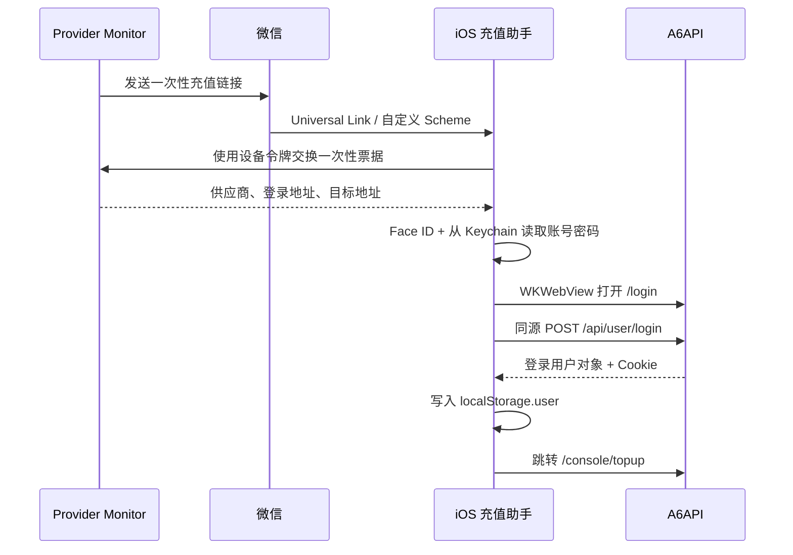

# iOS 自动登录 A6API 并打开充值页实施指南

> 文档状态：实施设计与操作指导。本文中的 iOS App、设备配对接口和设备票据交换接口当前尚未包含在 Provider Monitor 中，需要按本文新增。A6API 不需要做任何调整。

## 1. 目标与最终体验

目标链路：

1. Provider Monitor 检测到供应商余额低于阈值。
2. 个人微信收到包含一次性充值入口的告警。
3. 在 iPhone 上点击入口。
4. iOS 通过 Universal Link 打开专用的“充值助手”App。
5. App 使用 Face ID 确认是设备本人。
6. App 在受控 `WKWebView` 中打开 `https://a6api.com/login`。
7. App 仅在确认当前页面属于 `https://a6api.com` 后，调用 A6API 的登录接口。
8. 登录结果写入 A6API 自己域名下的 `localStorage.user`。
9. App 自动跳转到 `https://a6api.com/console/topup`。
10. 用户在 A6API 官方页面中选择金额并完成支付。

该方案绕过的不是 A6API 安全机制，而是由用户自己的 iOS App 控制一个专用浏览器，在 A6API 的页面上下文中完成正常登录。普通中转网页无法做到这一点，因为它不能跨域写入 `a6api.com` 的本地存储。

## 2. 适用范围与限制

本指南的 A6API 协议基线验证日期为 2026-07-25。验证时，公开状态接口显示 Turnstile 未启用，登录前端仍向 `/api/user/login` 提交 `username` 和 `password`，成功后把返回的 `data` 保存为用户状态。部署前应重新检查 [A6API 状态接口](https://a6api.com/api/status) 和当前登录页面，不能把本文记录的响应结构视为永久协议。

适用条件：

- A6API 继续提供 `POST /api/user/login`。
- 登录请求仍接受 `username` 和 `password`。
- 登录成功结果仍能作为 A6API 前端的用户对象写入 `localStorage.user`。
- 充值页面仍是 `/console/topup`。
- 账号未强制启用 Turnstile、短信验证码或双因素认证。
- 使用者拥有该 A6API 账号，并被允许使用自动化登录。

必须接受的限制：

- iPhone 上需要安装一个自行签名的 App。
- 微信内置浏览器是否直接唤起 Universal Link 由微信决定；必要时需要再点击一次“打开充值助手”。
- A6API 登录页面、接口或返回结构变化后，App 可能需要更新。
- App 只负责登录和打开官方充值页，不自动选择金额、不调用支付接口、不确认付款。
- 登录遇到 2FA、Turnstile 或风控时，必须停下并显示人工登录页，不能循环重试。

## 3. 推荐架构



第一版建议把 A6API 网页账号和密码保存在 iPhone Keychain 中，而不是让 Provider Monitor 把密码返回给手机。这样设备交换接口只返回供应商元数据，服务端不会新增一个“下载供应商密码”的接口。

## 4. 准备条件

### 4.1 必需资源

- 一台能运行当前稳定版 Xcode 的 Mac。
- 一台用于真机测试的 iPhone。
- 一个 Apple 开发者团队，能够给 App ID 开启 Associated Domains。
- 一个固定 Bundle ID，例如 `ci.us.fo2.provider-recharge`。
- Provider Monitor 的公网 HTTPS 地址，例如 `https://monitor.fo2.us.ci`。
- 对该域名反向代理和 `/.well-known/` 路径的控制权。
- A6API 网页登录账号和密码。

长期安装建议使用付费 Apple Developer Program，并通过 Development、Ad Hoc 或 TestFlight 分发。仅使用 Personal Team 时，签名有效期和可用能力可能受限。

### 4.2 本文示例变量

开始前记录以下值，并在后续示例中替换：

| 变量 | 示例 | 获取位置 |
|---|---|---|
| `MONITOR_HOST` | `monitor.fo2.us.ci` | Provider Monitor 公网域名 |
| `TEAM_ID` | `ABCDE12345` | Apple Developer 账户 Membership |
| `BUNDLE_ID` | `ci.us.fo2.provider-recharge` | Xcode Target 的 Bundle Identifier |
| `APP_ID` | `ABCDE12345.ci.us.fo2.provider-recharge` | `TEAM_ID.BUNDLE_ID` |
| `A6_ORIGIN` | `https://a6api.com` | 固定值 |
| `A6_LOGIN_URL` | `https://a6api.com/login` | 固定值 |
| `A6_TARGET_URL` | `https://a6api.com/console/topup` | 固定值 |

## 5. Provider Monitor 后端需要新增的能力

以下接口当前不存在，必须先实现。路径可以调整，但 App 和服务端必须保持一致。

### 5.0 当前仓库中的建议落点

| 文件 | 操作 | 责任 |
|---|---|---|
| `src/db/index.js` | 修改 | 增加设备、配对码表和数据库迁移 |
| `src/repositories/recharge-device-repository.js` | 新增 | 配对码、设备令牌哈希、撤销和查询 |
| `src/services/recharge-device-service.js` | 新增 | 配对、设备认证、票据交换和限流后的业务校验 |
| `src/services/recharge-link-service.js` | 修改 | 增加 `consumeForDevice()`，原子消费票据并只返回安全元数据 |
| `src/server.js` | 修改 | 注册设备 API、交换 API、AASA 路由和审计 |
| `public/app.js` | 修改 | 增加设备列表、生成配对码、撤销设备和 `ios_helper` 模式 |
| `public/recharge-entry.js` | 修改 | Universal Link 未拉起 App 时显示自定义 Scheme 兜底 |
| `tests/recharge-device.test.js` | 新增 | 配对、鉴权、过期、重放、撤销和并发消费测试 |
| `tests/recharge-login.test.js` | 修改 | 覆盖 iOS 助手签发及网页降级行为 |

建议新增环境变量：

```dotenv
PROVIDER_MONITOR_IOS_APP_ID=ABCDE12345.ci.us.fo2.provider-recharge
PROVIDER_MONITOR_IOS_UNIVERSAL_LINK_HOST=monitor.fo2.us.ci
```

服务启动时校验 `PROVIDER_MONITOR_IOS_APP_ID` 格式，并用它生成 AASA 响应。不要把 Team ID 或 Bundle ID 硬编码到通用镜像中。

### 5.1 数据表

新增两张表：

```sql
CREATE TABLE recharge_devices (
  id TEXT PRIMARY KEY,
  name TEXT NOT NULL,
  token_hash TEXT NOT NULL UNIQUE,
  enabled INTEGER NOT NULL DEFAULT 1,
  paired_at TEXT NOT NULL,
  last_used_at TEXT,
  revoked_at TEXT
);

CREATE TABLE recharge_device_pairing_codes (
  id TEXT PRIMARY KEY,
  code_hash TEXT NOT NULL UNIQUE,
  expires_at TEXT NOT NULL,
  consumed_at TEXT,
  created_at TEXT NOT NULL
);
```

约束要求：

- 设备令牌至少 32 个随机字节，只在配对成功响应中返回一次。
- 数据库只保存设备令牌的 SHA-256 哈希。
- 配对码至少 8 位随机字符，建议 10 分钟过期且只能使用一次。
- 禁止在日志、审计详情和错误信息中记录原始设备令牌、配对码或充值票据。

### 5.2 创建配对码

管理后台登录后调用：

```http
POST /api/recharge-devices/pairing-codes
Content-Type: application/json
X-CSRF-Token: <当前后台 CSRF Token>

{}
```

响应示例：

```json
{
  "code": "J7F4-K9QD",
  "expiresAt": "2026-07-25T08:10:00.000Z"
}
```

该接口应使用现有后台认证、CSRF 和操作审计。建议在“设置与备份”中增加“iOS 充值设备”区域，用于生成配对码、查看设备和撤销设备。

### 5.3 iPhone 完成配对

App 第一次启动时调用：

```http
POST /api/recharge-devices/pair
Content-Type: application/json

{
  "code": "J7F4-K9QD",
  "name": "Apricity 的 iPhone"
}
```

响应示例：

```json
{
  "deviceId": "5d75af2d-2fa9-4e16-af6c-581377dbe7d2",
  "deviceToken": "<至少 32 字节的 base64url 随机令牌>"
}
```

服务端必须：

1. 原子检查配对码未过期且未使用。
2. 原子写入 `consumed_at`，防止并发重复配对。
3. 生成设备令牌并只返回一次。
4. 仅保存令牌哈希。
5. 对 IP 和失败次数做限流。

### 5.4 设备交换充值票据

App 收到 Universal Link 后调用：

```http
POST /api/recharge-device/exchange
Authorization: RechargeDevice <deviceToken>
X-Recharge-Device-Id: <deviceId>
Content-Type: application/json

{
  "ticket": "<recharge-entry URL 中的 ticket>"
}
```

成功响应只返回非敏感数据：

```json
{
  "connectionId": "e9bd3ae7-5ba6-43d1-88d0-6275d0506583",
  "providerName": "a6api",
  "adapterType": "new-api",
  "baseUrl": "https://a6api.com",
  "loginUrl": "https://a6api.com/login",
  "targetUrl": "https://a6api.com/console/topup",
  "expiresAt": "2026-07-25T08:01:00.000Z"
}
```

交换接口必须执行以下校验：

1. 设备存在、启用且令牌哈希匹配。
2. 票据字符格式符合现有 base64url 规则。
3. 票据哈希存在、未过期且未消费。
4. 供应商适配器为允许的类型。
5. `baseUrl`、`loginUrl` 和 `targetUrl` 都是 HTTPS。
6. `loginUrl`、`targetUrl` 与 `baseUrl` 完全同源。
7. 对 A6API 第一版严格限定主机名为 `a6api.com`。
8. 原子消费票据；重复交换返回 HTTP `410`。
9. 响应设置 `Cache-Control: no-store, max-age=0` 和 `Pragma: no-cache`。
10. 审计只记录设备 ID、供应商 ID、适配器和结果，不记录票据或密码。

建议在 `RechargeLinkService` 中新增专用的 `consumeForDevice()`，不要让设备 API直接复用返回账号密码的 HTML 渲染流程。

### 5.5 供应商配置

A6API 供应商至少配置为：

```text
基础地址：https://a6api.com
适配器：New API
充值链接：https://a6api.com/console/topup
充值登录方式：适配器自动登录或 iOS 助手
```

若新增独立模式，建议保存：

```json
{
  "rechargeLogin": {
    "enabled": true,
    "client": "ios_helper"
  }
}
```

`client=ios_helper` 时，签发票据不应要求服务端保存 `webUsername` 和 `webPassword`，因为凭据由 iPhone Keychain 保存。

## 6. 配置 Universal Link

Apple 要求 App 与网站双向声明 Associated Domains。官方要求 AASA 文件使用 HTTPS、不能重定向，并且文件名没有扩展名。参考：[Supporting associated domains](https://developer.apple.com/documentation/xcode/supporting-associated-domains)。

### 6.1 创建 AASA 内容

把下面的 `TEAM_ID` 和 `BUNDLE_ID` 替换为真实值：

```json
{
  "applinks": {
    "details": [
      {
        "appIDs": [
          "ABCDE12345.ci.us.fo2.provider-recharge"
        ],
        "components": [
          {
            "/": "/recharge-entry",
            "comment": "Open Provider Recharge Helper for one-time recharge tickets"
          }
        ]
      }
    ]
  }
}
```

### 6.2 发布 AASA

必须可以无登录、无跳转访问：

```text
https://monitor.fo2.us.ci/.well-known/apple-app-site-association
```

响应要求：

```text
HTTP 200
Content-Type: application/json
无 301/302/307/308
```

可在 Provider Monitor 增加一个显式 Express 路由返回 JSON，也可以由 Nginx 直接返回静态文件。不要依赖 Express 静态目录对点目录的默认行为。

Nginx 反向代理示例：

```nginx
location = /.well-known/apple-app-site-association {
    proxy_pass http://127.0.0.1:9872;
    proxy_set_header Host $host;
    proxy_set_header X-Forwarded-Proto https;
}

location / {
    proxy_pass http://127.0.0.1:9872;
    proxy_set_header Host $host;
    proxy_set_header X-Forwarded-Proto https;
    proxy_set_header X-Forwarded-For $proxy_add_x_forwarded_for;
}
```

发布后验证：

```powershell
curl.exe -i https://monitor.fo2.us.ci/.well-known/apple-app-site-association
```

### 6.3 Apple CDN 缓存注意事项

iOS 会通过 Apple 管理的 CDN 获取 AASA。Apple 文档说明首次抓取可能不是即时完成，设备后续也会周期更新。AASA 修改后应：

1. 确认源站返回的新内容。
2. 等待 Apple CDN 更新。
3. 删除旧 App。
4. 重启 iPhone。
5. 重新从 Xcode 安装 App。

排查参考：[TN3155: Debugging universal links](https://developer.apple.com/documentation/technotes/tn3155-debugging-universal-links)。

## 7. 创建 iOS App

### 7.1 新建工程

1. 打开 Xcode。
2. 选择 `File -> New -> Project`。
3. 选择 `iOS -> App`。
4. Product Name 填写 `ProviderRecharge`。
5. Interface 选择 `SwiftUI`。
6. Language 选择 `Swift`。
7. Bundle Identifier 设置为 `ci.us.fo2.provider-recharge`。
8. Deployment Target 选择你的 iPhone 支持的版本；建议只支持仍在安全更新范围内的 iOS。
9. 在 `Signing & Capabilities` 中选择正确 Team，并确认真机签名成功。

### 7.2 开启 Associated Domains

1. 打开 Target 的 `Signing & Capabilities`。
2. 点击 `+ Capability`。
3. 添加 `Associated Domains`。
4. 添加以下条目，不要包含路径或尾部斜杠：

```text
applinks:monitor.fo2.us.ci
```

该 entitlement 的格式参考：[Associated Domains Entitlement](https://developer.apple.com/documentation/bundleresources/entitlements/com.apple.developer.associated-domains)。

### 7.3 添加自定义 Scheme 作为微信兜底

Universal Link 仍是主路径。自定义 Scheme 只在微信没有把 HTTPS 链接交给 iOS 时使用。

1. 打开 Target 的 `Info`。
2. 展开 `URL Types`。
3. 新增 URL Type。
4. Identifier 填写 `ci.us.fo2.provider-recharge`。
5. URL Schemes 填写：

```text
providerrecharge
```

兜底 URL 格式：

```text
providerrecharge://open?ticket=<一次性票据>
```

自定义 Scheme 不能单独作为安全边界。App 仍必须向 Provider Monitor 校验一次性票据和设备令牌。

### 7.4 配置 Face ID 描述

在 Target 的 Info 中增加：

```text
Privacy - Face ID Usage Description
```

值建议：

```text
用于确认由设备本人打开供应商充值页面。
```

## 8. 在 Keychain 保存设备身份和供应商凭据

Keychain 适合保存小型敏感数据，参考：[Apple Keychain Services](https://developer.apple.com/documentation/security/keychain-services)。

创建 `KeychainStore.swift`：

```swift
import Foundation
import Security

enum KeychainStore {
    private static let service = "ci.us.fo2.provider-recharge"

    static func save(_ data: Data, account: String) throws {
        let base: [String: Any] = [
            kSecClass as String: kSecClassGenericPassword,
            kSecAttrService as String: service,
            kSecAttrAccount as String: account
        ]

        SecItemDelete(base as CFDictionary)

        var query = base
        query[kSecValueData as String] = data
        query[kSecAttrAccessible as String] = kSecAttrAccessibleWhenUnlockedThisDeviceOnly

        let status = SecItemAdd(query as CFDictionary, nil)
        guard status == errSecSuccess else {
            throw NSError(domain: NSOSStatusErrorDomain, code: Int(status))
        }
    }

    static func load(account: String) throws -> Data? {
        let query: [String: Any] = [
            kSecClass as String: kSecClassGenericPassword,
            kSecAttrService as String: service,
            kSecAttrAccount as String: account,
            kSecReturnData as String: true,
            kSecMatchLimit as String: kSecMatchLimitOne
        ]

        var item: CFTypeRef?
        let status = SecItemCopyMatching(query as CFDictionary, &item)
        if status == errSecItemNotFound { return nil }
        guard status == errSecSuccess, let data = item as? Data else {
            throw NSError(domain: NSOSStatusErrorDomain, code: Int(status))
        }
        return data
    }

    static func delete(account: String) {
        let query: [String: Any] = [
            kSecClass as String: kSecClassGenericPassword,
            kSecAttrService as String: service,
            kSecAttrAccount as String: account
        ]
        SecItemDelete(query as CFDictionary)
    }
}
```

定义供应商凭据：

```swift
struct WebCredentials: Codable {
    let username: String
    let password: String
}
```

保存 A6API 凭据时，以 Provider Monitor 的 `connectionId` 作为 Keychain account：

```swift
let credentials = WebCredentials(username: username, password: password)
let data = try JSONEncoder().encode(credentials)
try KeychainStore.save(data, account: "provider.<connectionId>")
```

设备配对成功后保存：

```swift
try KeychainStore.save(Data(deviceId.utf8), account: "device.id")
try KeychainStore.save(Data(deviceToken.utf8), account: "device.token")
```

不要把密码、设备令牌或票据保存到 `UserDefaults`、日志、崩溃报告字段或分析事件中。

## 9. 实现设备配对

创建 `ProviderMonitorClient.swift`，基础地址固定为你自己的监控域名：

```swift
import Foundation

struct PairResponse: Decodable {
    let deviceId: String
    let deviceToken: String
}

struct RechargeExchange: Decodable {
    let connectionId: String
    let providerName: String
    let adapterType: String
    let baseUrl: URL
    let loginUrl: URL
    let targetUrl: URL
    let expiresAt: String
}

enum ClientError: Error {
    case invalidResponse
    case http(Int)
}

final class ProviderMonitorClient {
    private let baseURL = URL(string: "https://monitor.fo2.us.ci")!
    private let decoder = JSONDecoder()

    func pair(code: String, name: String) async throws -> PairResponse {
        var request = URLRequest(url: baseURL.appending(path: "api/recharge-devices/pair"))
        request.httpMethod = "POST"
        request.setValue("application/json", forHTTPHeaderField: "Content-Type")
        request.httpBody = try JSONEncoder().encode(["code": code, "name": name])

        let (data, response) = try await URLSession.shared.data(for: request)
        guard let http = response as? HTTPURLResponse else { throw ClientError.invalidResponse }
        guard http.statusCode == 200 else { throw ClientError.http(http.statusCode) }
        return try decoder.decode(PairResponse.self, from: data)
    }

    func exchange(ticket: String, deviceId: String, deviceToken: String) async throws -> RechargeExchange {
        var request = URLRequest(url: baseURL.appending(path: "api/recharge-device/exchange"))
        request.httpMethod = "POST"
        request.setValue("application/json", forHTTPHeaderField: "Content-Type")
        request.setValue("RechargeDevice \(deviceToken)", forHTTPHeaderField: "Authorization")
        request.setValue(deviceId, forHTTPHeaderField: "X-Recharge-Device-Id")
        request.httpBody = try JSONEncoder().encode(["ticket": ticket])

        let (data, response) = try await URLSession.shared.data(for: request)
        guard let http = response as? HTTPURLResponse else { throw ClientError.invalidResponse }
        guard http.statusCode == 200 else { throw ClientError.http(http.statusCode) }
        return try decoder.decode(RechargeExchange.self, from: data)
    }
}
```

生产实现还应：

- 给请求设置合理超时。
- 将 HTTP `401` 显示为“设备已失效，请重新配对”。
- 将 HTTP `404` 显示为“充值入口无效”。
- 将 HTTP `410` 显示为“充值入口已使用或已过期”。
- 不把服务端响应正文直接写入日志。
- 使用系统默认 TLS 验证，禁止在证书错误时继续访问。

## 10. 解析 Universal Link

创建 `RechargeRouter.swift`：

```swift
import Foundation
import Combine

@MainActor
final class RechargeRouter: ObservableObject {
    @Published var pendingTicket: String?
    @Published var errorMessage: String?

    private let ticketPattern = try! NSRegularExpression(pattern: "^[A-Za-z0-9_-]{40,100}$")

    func handle(_ url: URL) {
        let isUniversalLink = url.scheme == "https"
            && url.host == "monitor.fo2.us.ci"
            && url.path == "/recharge-entry"
        let isFallbackScheme = url.scheme == "providerrecharge"
            && url.host == "open"

        guard isUniversalLink || isFallbackScheme else {
            errorMessage = "不受支持的充值入口"
            return
        }

        guard let ticket = URLComponents(url: url, resolvingAgainstBaseURL: false)?
            .queryItems?
            .first(where: { $0.name == "ticket" })?
            .value else {
            errorMessage = "充值票据缺失"
            return
        }

        let range = NSRange(ticket.startIndex..., in: ticket)
        guard ticketPattern.firstMatch(in: ticket, range: range) != nil else {
            errorMessage = "充值票据格式无效"
            return
        }

        pendingTicket = ticket
    }
}
```

在 App 入口同时处理自定义 Scheme 和 Universal Link：

```swift
import SwiftUI

@main
struct ProviderRechargeApp: App {
    @StateObject private var router = RechargeRouter()

    var body: some Scene {
        WindowGroup {
            ContentView()
                .environmentObject(router)
                .onOpenURL { router.handle($0) }
                .onContinueUserActivity(NSUserActivityTypeBrowsingWeb) { activity in
                    if let url = activity.webpageURL {
                        router.handle(url)
                    }
                }
        }
    }
}
```

票据只保存在内存中。App 进入后台、用户取消或交换失败后，应清空 `pendingTicket`。

## 11. Face ID / 设备密码确认

在交换票据前执行本机身份确认：

```swift
import LocalAuthentication

func requireDeviceOwnerAuthentication() async throws {
    let context = LAContext()
    try await context.evaluatePolicy(
        .deviceOwnerAuthentication,
        localizedReason: "确认打开供应商充值页面"
    )
}
```

`.deviceOwnerAuthentication` 在可用时使用 Face ID，并允许设备密码兜底。参考：[LocalAuthentication evaluatePolicy](https://developer.apple.com/documentation/localauthentication/lacontext/evaluatepolicy(_:localizedreason:reply:))。

Face ID 失败、用户取消或 App 进入后台时，不要继续交换票据或打开 WebView。

## 12. 实现安全的 A6API WKWebView 登录

### 12.1 关键原则

- 使用 `WKWebsiteDataStore.default()`，让专用 App 保留 A6API Cookie 和本地存储。
- 只有当前主框架 URL 的 scheme 为 `https`、host 为 `a6api.com` 时才允许注入。
- 使用 `callAsyncJavaScript(...arguments:)` 传递账号密码，禁止字符串拼接。
- 脚本运行在 `.page` content world，才能写入 A6API 页面使用的本地存储。
- 登录脚本每次票据只运行一次。
- 跳转到目标页后绝不再次注入。
- 不添加通用 `WKScriptMessageHandler`，减少来自供应商页面的原生调用面。

Apple 的 `callAsyncJavaScript` 会把参数作为结构化值传入异步 JavaScript 函数，适合避免凭据转义问题。参考：[WKWebView callAsyncJavaScript](https://developer.apple.com/documentation/webkit/wkwebview/callasyncjavascript(_:arguments:in:contentworld:))。

### 12.2 WebView 组件

创建 `A6RechargeWebView.swift`：

```swift
import SwiftUI
import UIKit
import WebKit

struct A6RechargeWebView: UIViewRepresentable {
    let loginURL: URL
    let targetURL: URL
    let credentials: WebCredentials
    let onError: (String) -> Void

    func makeCoordinator() -> Coordinator {
        Coordinator(parent: self)
    }

    func makeUIView(context: Context) -> WKWebView {
        let configuration = WKWebViewConfiguration()
        configuration.websiteDataStore = .default()
        configuration.defaultWebpagePreferences.allowsContentJavaScript = true

        let webView = WKWebView(frame: .zero, configuration: configuration)
        webView.navigationDelegate = context.coordinator
        webView.uiDelegate = context.coordinator
        webView.load(URLRequest(
            url: loginURL,
            cachePolicy: .reloadIgnoringLocalCacheData,
            timeoutInterval: 20
        ))
        return webView
    }

    func updateUIView(_ webView: WKWebView, context: Context) {}

    final class Coordinator: NSObject, WKNavigationDelegate, WKUIDelegate {
        private let parent: A6RechargeWebView
        private var loginStarted = false

        init(parent: A6RechargeWebView) {
            self.parent = parent
        }

        func webView(_ webView: WKWebView, didFinish navigation: WKNavigation!) {
            guard !loginStarted else { return }
            guard let current = webView.url,
                  current.scheme == "https",
                  current.host == "a6api.com" else {
                parent.onError("登录页面来源不受信任")
                return
            }

            guard parent.targetURL.scheme == "https",
                  parent.targetURL.host == "a6api.com" else {
                parent.onError("充值目标不受信任")
                return
            }

            loginStarted = true
            Task { @MainActor in
                await runLogin(in: webView)
            }
        }

        @MainActor
        private func runLogin(in webView: WKWebView) async {
            let script = #"""
            const response = await fetch('/api/user/login', {
              method: 'POST',
              credentials: 'include',
              headers: {
                'Accept': 'application/json',
                'Content-Type': 'application/json'
              },
              body: JSON.stringify({
                username: username,
                password: password
              })
            });

            let result;
            try {
              result = await response.json();
            } catch {
              return { ok: false, message: '登录接口没有返回 JSON' };
            }

            if (!response.ok || result?.success !== true) {
              return {
                ok: false,
                message: result?.message || `登录失败（HTTP ${response.status}）`
              };
            }

            if (result?.data?.require_2fa === true) {
              return { ok: false, interactive: true, message: '账号需要双因素认证' };
            }

            if (!result?.data || typeof result.data !== 'object') {
              return { ok: false, message: '登录结果缺少用户数据' };
            }

            localStorage.setItem('user', JSON.stringify(result.data));
            window.location.replace(targetURL);
            return { ok: true };
            """#

            do {
                let value = try await webView.callAsyncJavaScript(
                    script,
                    arguments: [
                        "username": parent.credentials.username,
                        "password": parent.credentials.password,
                        "targetURL": parent.targetURL.absoluteString
                    ],
                    in: nil,
                    contentWorld: .page
                )

                if let result = value as? [String: Any],
                   result["ok"] as? Bool != true {
                    loginStarted = false
                    parent.onError(result["message"] as? String ?? "A6API 登录失败")
                }
            } catch {
                loginStarted = false
                parent.onError("执行登录流程失败")
            }
        }

        func webView(
            _ webView: WKWebView,
            decidePolicyFor navigationAction: WKNavigationAction,
            decisionHandler: @escaping (WKNavigationActionPolicy) -> Void
        ) {
            guard let url = navigationAction.request.url else {
                decisionHandler(.cancel)
                return
            }

            if url.scheme == "https" {
                if url.host == "a6api.com" {
                    decisionHandler(.allow)
                } else {
                    decisionHandler(.cancel)
                    Task { @MainActor in
                        await UIApplication.shared.open(url)
                    }
                }
                return
            }

            if url.scheme == "http" {
                decisionHandler(.cancel)
                parent.onError("已阻止不安全的 HTTP 跳转")
                return
            }

            decisionHandler(.cancel)
            let allowedPaymentSchemes = Set(["weixin", "alipays", "alipay"])
            if let scheme = url.scheme?.lowercased(), allowedPaymentSchemes.contains(scheme) {
                Task { @MainActor in
                    guard UIApplication.shared.canOpenURL(url) else { return }
                    await UIApplication.shared.open(url)
                }
            }
        }

        func webView(
            _ webView: WKWebView,
            createWebViewWith configuration: WKWebViewConfiguration,
            for navigationAction: WKNavigationAction,
            windowFeatures: WKWindowFeatures
        ) -> WKWebView? {
            if let url = navigationAction.request.url,
               url.scheme == "https" {
                Task { @MainActor in
                    await UIApplication.shared.open(url)
                }
            }
            return nil
        }
    }
}
```

说明：

- 当前 A6API 前端把 `result.data` 直接作为用户对象保存，因此示例按该结构写入。
- 如果以后 A6API 返回 `{ access_token, user, session }` 形式的新认证包，必须根据其官方前端同步更新，不能盲目写入。
- `callAsyncJavaScript` 的返回值类型在不同系统版本上可能桥接为 NSDictionary；生产代码应兼容 `[String: Any]` 和 `NSDictionary`。
- 不要在错误提示中包含原始响应数据，因为其中可能出现用户信息或令牌。

### 12.3 人工验证降级

出现以下任一情况时停止自动化，并保留当前 A6API 登录页供用户人工操作：

- `require_2fa=true`。
- 返回消息包含 Turnstile、captcha、verification 或 challenge。
- 登录接口返回结构未知。
- A6API 主机名发生变化。
- 页面证书验证失败。

不要在失败后自动重复提交密码。一次用户点击最多发起一次自动登录请求。

## 13. ContentView 串联流程

页面状态建议：

```swift
enum RechargeState {
    case idle
    case authenticatingDevice
    case exchangingTicket
    case credentialsRequired(RechargeExchange)
    case opening(RechargeExchange, WebCredentials)
    case failed(String)
}
```

收到票据后的顺序：

1. 将状态改为 `authenticatingDevice`。
2. 调用 Face ID / 设备密码。
3. 从 Keychain 读取 `device.id` 和 `device.token`。
4. 调用 `/api/recharge-device/exchange`。
5. 严格校验响应中的 URL。
6. 使用 `connectionId` 从 Keychain 读取供应商凭据。
7. 没有凭据时显示一次设置表单并保存到 Keychain。
8. 创建 `A6RechargeWebView`。
9. 无论成功或失败，都清空内存中的票据。

URL 校验函数建议：

```swift
func validateA6(_ exchange: RechargeExchange) -> Bool {
    exchange.adapterType == "new-api"
        && exchange.baseUrl.scheme == "https"
        && exchange.baseUrl.host == "a6api.com"
        && exchange.loginUrl.scheme == "https"
        && exchange.loginUrl.host == "a6api.com"
        && exchange.targetUrl.scheme == "https"
        && exchange.targetUrl.host == "a6api.com"
        && exchange.targetUrl.path == "/console/topup"
}
```

## 14. 微信内置浏览器兜底页

Universal Link 在 Safari、邮件和信息中通常可直接工作，但第三方浏览器是否交给系统处理由第三方决定。Apple 也明确指出第三方浏览器可能不支持全部 Universal Link 行为。

保留现有 `/recharge-entry` 网页，并增加：

```html
<a class="button primary"
   href="providerrecharge://open?ticket=<一次性票据>">
  打开 iOS 充值助手
</a>
```

同时保留：

- “打开 A6API 充值页面”人工入口。
- “充值助手未安装”提示。
- 不在页面 HTML 中输出账号密码。
- 页面继续使用 `Cache-Control: no-store`。

不要用无限定时器反复拉起自定义 Scheme。微信拦截时让用户主动点击按钮。

## 15. 真机安装与验证

### 15.1 Xcode 真机安装

1. 用数据线或已配对的无线调试连接 iPhone。
2. 在 Xcode 顶部选择该 iPhone。
3. 确认 Target 的 Team、Bundle ID 和签名没有错误。
4. 点击 Run。
5. iPhone 第一次运行时按系统提示信任开发者证书。
6. 启动 App，输入 Provider Monitor 生成的配对码。
7. 在 App 中保存 A6API 网页账号和密码。

### 15.2 Universal Link 基础测试

1. 将真实充值链接发送到“信息”或“备忘录”。
2. 链接必须形如：

```text
https://monitor.fo2.us.ci/recharge-entry?ticket=<有效票据>
```

3. 点击链接，确认系统直接打开 `ProviderRecharge`。
4. 若仍打开网页，长按链接查看是否出现“在 ProviderRecharge 中打开”。
5. 删除并重装 App 后再次测试。
6. 确认 AASA 的 `APP_ID` 与实际签名 entitlement 完全一致。

不要只在模拟器验证 Universal Link，最终必须使用真机。

### 15.3 完整告警链路测试

1. 在 Provider Monitor 测试中心选择 A6API。
2. 选择“仅打开移动端预览，不发送通知”先生成入口。
3. 把入口发送到 iPhone 测试 Universal Link。
4. 确认 Face ID 出现。
5. 确认 App 交换票据成功。
6. 确认 WebView 只请求一次 `/api/user/login`。
7. 确认最终路径是 `/console/topup`。
8. 返回 Provider Monitor，确认审计日志只有票据消费和设备使用信息。
9. 再次点击同一链接，必须提示入口已使用或过期。
10. 最后取消“仅预览”，用个人微信通道做一次真实消息测试。

### 15.4 必测异常

| 场景 | 预期结果 |
|---|---|
| 票据已过期 | App 显示过期，不打开 WebView |
| 票据已使用 | 服务端返回 410，App 停止 |
| 设备已撤销 | 服务端返回 401，要求重新配对 |
| Face ID 取消 | 不交换票据，不读取供应商凭据 |
| A6API 密码错误 | 显示登录失败，不自动重试 |
| A6API 要求 2FA | 保留人工登录页 |
| 目标 URL 被改成其他域名 | App 拒绝打开 |
| HTTPS 证书错误 | 系统连接失败，不提供绕过按钮 |
| App 进入后台 | 清空待处理票据和内存凭据 |
| 同一票据并发点击 | 只能有一个交换成功 |

## 16. 清理 A6API 登录状态

充值助手应提供“清除供应商会话”命令。因为该 App 只用于充值，可以清除整个默认 WebsiteDataStore：

```swift
import WebKit

func clearWebSessions() async {
    let store = WKWebsiteDataStore.default()
    let types = WKWebsiteDataStore.allWebsiteDataTypes()
    await withCheckedContinuation { continuation in
        store.removeData(ofTypes: types, modifiedSince: .distantPast) {
            continuation.resume()
        }
    }
}
```

同时提供单独的“删除 A6API 凭据”按钮：

```swift
KeychainStore.delete(account: "provider.<connectionId>")
```

撤销设备时需要同时：

1. Provider Monitor 将设备标记为 revoked。
2. App 删除 `device.id` 和 `device.token`。
3. App 删除所有供应商 Keychain 凭据。
4. App 清除 WKWebView 网站数据。

## 17. 服务端安全清单

- [ ] Provider Monitor 公网地址只使用 HTTPS。
- [ ] 设备令牌至少 32 个随机字节。
- [ ] 数据库只保存设备令牌哈希。
- [ ] 配对码短期有效且一次性使用。
- [ ] 设备交换接口有独立限流。
- [ ] 充值票据原子消费。
- [ ] 只允许已登记设备交换票据。
- [ ] 响应带 `Cache-Control: no-store`。
- [ ] 日志不包含票据、设备令牌、用户名或密码。
- [ ] 登录和目标 URL 都要求 HTTPS 且与供应商同源。
- [ ] 第一版只允许 `a6api.com`。
- [ ] 设备可以在后台单独撤销。
- [ ] 备份导出不会把设备原始令牌写入普通配置 JSON。
- [ ] 加密灾备包含设备记录时仍只包含令牌哈希。

## 18. iOS 安全清单

- [ ] 账号密码只保存到 Keychain。
- [ ] Keychain 使用 `WhenUnlockedThisDeviceOnly`。
- [ ] 不把敏感值保存到 UserDefaults。
- [ ] 不打印账号、密码、票据、Cookie 或登录响应。
- [ ] 打开充值前进行 Face ID / 设备密码确认。
- [ ] 只在 `https://a6api.com` 注入登录脚本。
- [ ] 使用 `callAsyncJavaScript` 的结构化参数，不拼接脚本字符串。
- [ ] 不忽略 TLS 或证书错误。
- [ ] App 进入后台时清空内存票据和凭据。
- [ ] 登录请求每次只提交一次。
- [ ] 外部支付域名交给系统浏览器或支付 App。
- [ ] 提供清除网站会话、删除凭据和解除配对功能。

## 19. 常见问题排查

### 19.1 点击微信链接只打开网页

依次检查：

1. App 是否已安装。
2. Xcode Associated Domains 是否包含 `applinks:monitor.fo2.us.ci`。
3. AASA 是否是 HTTP 200、JSON Content-Type、没有重定向。
4. AASA 中的 `TEAM_ID.BUNDLE_ID` 是否与签名一致。
5. AASA 是否已被 Apple CDN 更新。
6. 删除并重装 App 后是否恢复。
7. 微信页面中的“打开充值助手”自定义 Scheme 按钮是否工作。

### 19.2 App 打开后提示票据无效

检查：

- 是否把 HTML 转义后的票据传给 App。
- 是否重复点击了同一链接。
- Provider Monitor 服务器时间是否准确。
- 票据有效期是否太短。
- App 是否在 Face ID 完成前就错误消费了票据。

### 19.3 登录成功后仍回到登录页

检查：

1. WebView 是否使用 `.page` content world。
2. 是否把完整 `result.data` 写入 `localStorage.user`。
3. WKWebView 是否使用默认持久 WebsiteDataStore。
4. A6API 是否改变登录响应结构。
5. A6API 页面是否还通过 `localStorage.user.id` 判断登录。
6. Cookie 是否被登录响应正常写入 WebView。

### 19.4 页面打开但支付按钮没有反应

检查：

- 是否把非 `a6api.com` 的 HTTPS 页面错误留在 WebView 中。
- `window.open` 是否由 `WKUIDelegate` 处理。
- 支付 App Scheme 是否已安装并可由 `UIApplication.open` 打开。
- 支付服务是否要求 Safari 而不是内嵌 WebView。

支付兼容问题应优先改为“交给系统打开”，不要为支付页面放宽脚本注入域名。

## 20. 建议的实施顺序

按以下顺序可以最快定位问题：

1. 在 Xcode 做一个只加载 A6API 的最小 WKWebView。
2. 用测试账号验证 `callAsyncJavaScript` 登录和跳转。
3. 加入 Keychain 保存凭据。
4. 加入 Face ID。
5. 在 Provider Monitor 实现设备配对和票据交换。
6. 使用手工粘贴 ticket 验证交换接口。
7. 发布 AASA 并配置 Associated Domains。
8. 验证“信息/备忘录 -> App”链路。
9. 增加微信自定义 Scheme 兜底按钮。
10. 接入测试中心的移动端预览。
11. 最后进行个人微信真实通知测试。

不要一开始同时调试微信、Universal Link、设备配对、WebView 和 A6API 登录。先证明 WebView 能登录，再逐层接入，故障边界会清楚很多。

## 21. 完成标准

只有同时满足以下条件，才能认为功能完成：

- 微信告警链接能在真机进入 App，或稳定显示可点击的 App 兜底按钮。
- 未登记设备无法交换票据。
- 同一票据只能成功交换一次。
- Face ID 取消后不发起 A6API 登录。
- A6API 正常账号能自动到达 `/console/topup`。
- 密码错误、2FA 和接口变化都有人工降级路径。
- 任何日志和导出中都找不到账号密码、设备令牌或原始票据。
- 外部支付跳转可用，且不会向非 A6API 页面注入登录脚本。
- 设备撤销后旧 App 立即失去票据交换能力。
