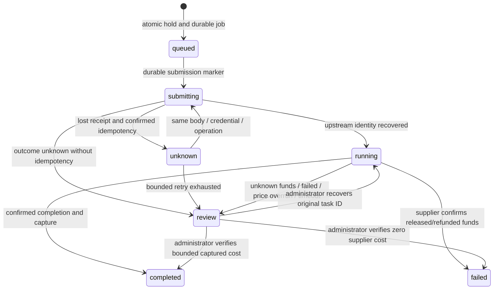

# Architecture and Financial Contract

## Ownership

The video adapter owns video ingress, admission, holds and settlement. Sub2API remains authoritative for identities, available balance and configured selling prices. Provider credentials never appear in client responses. There is exactly one financial owner per request; the adapter must not be placed behind Sub2API's native video billing.

## Price and Cost

Public model IDs are stable aliases, independent of supplier IDs. A model registration contains an accepted parameter domain and a verified, expiring supplier cost upper bound. Unknown options are rejected. All prices are exact decimals, rounded upward at eight fractional USD digits, matching the balance storage precision.

Selling-price precedence follows the supported native Grok subset:

1. Matching group model card in video mode.
2. Matching model-family/resolution override or group legacy resolution price.
3. Matching channel per-request/image/video card, with exact resolution tier or configured default.
4. No implicit native-provider fallback. Reject absent, zero, token or ambiguous pricing.

Independent video multiplier overrides shared group/user rates. Otherwise user-specific rate replaces group rate, then the station peak multiplier applies. Existing group profit controls can only tighten the adapter's global margin.

The adapter extends duration accounting to the exact accepted request duration rather than core Grok's 15-second clamp. This is possible because it owns video settlement, while preserving USD amount and usage-log fields in Sub2API. It never silently rewrites a user's selling price to compensate for insufficient profit.

Live, documented non-billable quotes can be configured. A quote must fit the verified upper bound. Catalog evidence, effective dates, FX bound, fee budget, sale price, user/group rates and financial guard parameters are stored in the per-task snapshot. A price read is not evidence that upstream funds were captured.

## State Machine



No transition from an uncertain operation to a new supplier or a new credential is allowed. No timeout, 404, error message or stopped client polling can independently authorize a refund. Creation retries are limited to three total attempts and require a documented idempotency contract; the original encrypted request bytes are used verbatim.

The verified minimum upstream key-retention duration is stored as `idempotencyRetentionSeconds`. Retry eligibility is conservatively measured from local reservation time, not from a restarted process or the last attempt. The entire HTTP transport deadline must fit inside the remaining retention window, rechecked after persisting the submission marker. Unknown operations past that duration enter review without another POST. An enabled idempotent provider without a verified retention duration is rejected at configuration load.

## Transactions

Admission acquires the shared budget row, locks the user and API key, rereads identity and pricing, verifies quota and margin, reserves full user price, updates key budgets, inserts the unique `(api_key_id, idempotency_key)` job and emits invalidation events in the same transaction.

The balance operation deliberately matches Sub2API's native batch-image holds:

```sql
UPDATE users
SET balance = balance - hold,
    frozen_balance = frozen_balance + hold
WHERE id = user_id AND balance >= hold;
```

`balance` is the available amount; do not subtract frozen balance a second time. Funds are removed from the spendable pool before upstream submission. The supplier request is outside the database transaction and preceded by a durable `submitting` marker.

Settlement locks the job, checks worker lease or administrator version, verifies actual charge/cost against the original hold and margin, releases the frozen pool, refunds any allowed difference, writes a single usage log and marks the job settled atomically. A retry after commit is a no-op. A transaction failure preserves the hold and can be retried.

Key quota and window consumption are reserved at admission. Refunds only reverse window consumption if the same original window is still active; replacing/resetting a window cannot generate extra available quota. Pricing is locked at admission, not recomputed at completion.

## Recovery and Cache Coherence

Workers claim jobs with `FOR UPDATE SKIP LOCKED`, unique lease owners and expiration. Stale workers cannot mutate or settle jobs. Non-idempotent `submitting` jobs recovered after a crash enter review without another POST. Idempotent jobs reuse their frozen operation.

Transactional native auth-invalidation outbox records invalidate Sub2API process-local auth snapshots. An adapter-owned durable cache outbox deletes the native Redis balance/auth/window keys and publishes native invalidation messages. Worker dispatch requires a healthy cache and drains the cache outbox first. Financial admission always reads and writes the authoritative database regardless of caches.

RPM admission uses the native Redis server time, user/group key formats and 120-second expiry. A group override replaces the group rate limit, while the user's global rate limit always applies. Idempotent replays never increment those counters. Redis failure blocks video admission; increments already made before a denied admission are conservative request-attempt counts and are not decremented.

Native user-platform quotas use Redis-authoritative usage and asynchronous absolute-value database snapshots. Writing the quota table directly would be overwritten by that flusher. Until that separate contract is supported, any active daily/weekly/monthly quota for the user's group platform blocks new video creation, including an explicit zero limit. Existing funded jobs can still settle and be read.

Shutdown stops dispatch, awaits a pending claim and any running jobs, then waits for HTTP requests before closing dependencies. A job claimed while shutdown begins is unlocked without submission. Startup failure closes any dependencies already opened and reports sanitized diagnostics.

Never log complete database/Redis URLs, authorization headers, prompt text, inline media, raw provider bodies or decrypted snapshots. Only job IDs and sanitized error codes are logged. Task lookups require the original key/user/group identity and IP rules; zero available balance and expired/exhausted quota do not prohibit old-task reads. Disabled or deleted identities still cannot read tasks.

## Deployment Contract

PostgreSQL and Redis must be the same authoritative instances used by Sub2API. The adapter does not alter native table structure and refuses missing schema columns. Its database role needs carefully scoped financial write permissions; an admin HTTP balance adjustment with read-then-write checks is insufficient for atomic reservations.

Dedicated video groups reduce ambiguity in model routing and account attribution. All native video path aliases must be routed to the adapter; a separate catalog path avoids replacing the relay's chat-model listing. Account attribution is metadata only, never a source of credentials or per-account billing multipliers.

Absolute protection from undocumented supplier price changes, provider fraud, administrator changes to frozen funds or an incorrect cash-realization factor is outside a protocol adapter's control. The enforced guarantee is that accepted requests satisfy the verified cost-bound and funding contract; unknown or unsupported inputs fail closed. Supplier-cost overrun pauses further spending and preserves evidence instead of silently charging more or refunding money that was already spent.
